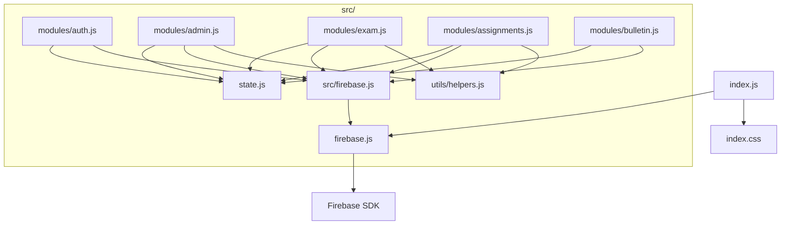

# 📖 專案程式碼導覽地圖

此文件幫助快速定位專案中各檔案的程式碼區塊與功能模組。

---

## 📊 專案統計

| 項目 | 數量 |
|------|------|
| **主程式 index.js** | 5,104 行 |
| **主程式函數** | 157+ |
| **模組化檔案** | 7 個 |
| **樣式表 index.css** | ~2,300 行 |

---

## 📁 專案結構

```
考試系統測試區(上線版)/
├── index.html          # 主 HTML 頁面
├── index.js            # 主程式 (5104 行)
├── index.css           # 主樣式表
├── firebase.js         # Firebase 配置與匯出 (80 行)
├── metadata.json       # 專案元資料
├── src/
│   ├── firebase.js     # Firebase 模組中繼層 (29 行)
│   ├── state.js        # 全域狀態管理模組 (157 行)
│   ├── modules/
│   │   ├── admin.js        # 管理員功能 (622 行)
│   │   ├── assignments.js  # 作業系統 (214 行)
│   │   ├── auth.js         # 認證模組 (58 行)
│   │   ├── bulletin.js     # 公告板模組 (82 行)
│   │   └── exam.js         # 考試邏輯 (214 行)
│   └── utils/
│       └── helpers.js      # 共用工具函數 (82 行)
└── Images/             # 圖片資源目錄
```

---

## 🔥 firebase.js (80 行)

Firebase 配置與初始化，匯出 auth、db 及所有 Firestore 方法。

| 行號 | 內容 |
|------|------|
| L1-27 | Firebase SDK 匯入 |
| L29-39 | Firebase 配置常數 |
| L41-55 | Firebase 初始化 |
| L57-79 | 匯出 auth, db 及方法 |

---

## 📦 src/ 模組化檔案

### 🔄 src/state.js (157 行)

全域狀態管理模組。

| 行號 | 函數/內容 | 說明 |
|------|-----------|------|
| L13-54 | `state` | 全域應用程式狀態物件 |
| L60-66 | `setExamHistoryListener()` | 設定考試歷史監聽器 |
| L68-74 | `setAdminStudentHistoryListener()` | 設定管理員學生監聽器 |
| L79-85 | `setRenderFunction()` | 設定渲染函數參照 |
| L87-144 | `setState()` | 更新狀態並觸發重新渲染 |
| L146-156 | `setLoading()` | 設定載入狀態 |

---

### 🔐 src/modules/auth.js (58 行)

認證模組 - 登入/登出功能。

| 行號 | 函數 | 說明 |
|------|------|------|
| L15-39 | `handleLogin()` | 使用者登入處理 |
| L41-57 | `handleLogout()` | 使用者登出處理 |

---

### 📝 src/modules/exam.js (214 行)

考試邏輯模組 - 考試開始、答題、完成等功能。

| 行號 | 函數 | 說明 |
|------|------|------|
| L18-76 | `startExam()` | 開始考試 |
| L78-90 | `handleAnswerSelection()` | 處理答案選擇 |
| L92-104 | `handleQuestionNavigation()` | 處理題目導航 |
| L106-115 | `handleJumpToQuestion()` | 跳至指定題目 |
| L117-161 | `handleBookmarkToggle()` | 處理書籤切換 |
| L163 | `handleReviewBookmarkToggle` | 書籤切換別名 |
| L166-213 | `handleFinishExam()` | 完成考試並儲存成績 |

---

### 🛠️ src/modules/admin.js (622 行)

管理員功能模組 - 科目、類別、題目、用戶管理。

| 行號 | 函數 | 說明 |
|------|------|------|
| **科目管理** | | |
| L25-79 | `handleAddSubject()` | 新增科目 |
| L81-118 | `handleDeleteSubject()` | 刪除科目 |
| **類別管理** | | |
| L122-184 | `handleAddCategory()` | 新增類別 |
| L186-208 | `handleDeleteCategory()` | 刪除類別 |
| **題目管理** | | |
| L212-254 | `handleUpdateQuestion()` | 更新題目 |
| L256-272 | `handleDeleteQuestion()` | 刪除題目 |
| L274-339 | `handleBulkUpload()` | 批次上傳題目 |
| L341-347 | `handleManualAddSubjectChange()` | 手動題目科目變更 |
| L349-355 | `handleManualAddCategoryChange()` | 手動題目類別變更 |
| L357-444 | `handleAddQuestion()` | 手動新增題目 |
| **用戶管理** | | |
| L448-471 | `handleUpdateUser()` | 更新用戶資料 |
| L473-527 | `handleDeleteUser()` | 刪除用戶 |
| L529-570 | `handleDeleteExamHistory()` | 刪除考試紀錄 |
| L572-621 | `handleDeleteBookmark()` | 刪除書籤 |

---

### ✏️ src/modules/assignments.js (214 行)

作業系統模組 - 手寫作業功能。

| 行號 | 函數 | 說明 |
|------|------|------|
| L22-87 | `handleAddAssignment()` | 新增作業 |
| L89-105 | `handleDeleteAssignment()` | 刪除作業 |
| L107-171 | `handleAssignmentSubmit()` | 學生提交作業 |
| L173-213 | `handleAdminGradeSubmission()` | 管理員評分作業 |

---

### 📢 src/modules/bulletin.js (82 行)

公告板模組 - 公告的新增、編輯、刪除。

| 行號 | 函數 | 說明 |
|------|------|------|
| L18-64 | `handleAddAnnouncement()` | 新增或編輯公告 |
| L66-81 | `handleDeleteAnnouncement()` | 刪除公告 |

---

### 🧰 src/utils/helpers.js (82 行)

共用工具函數模組。

| 行號 | 函數/內容 | 說明 |
|------|-----------|------|
| L15-20 | `formatTime()` | 秒數格式化為 m:ss |
| L27-30 | `sanitizeImagePath()` | 清理圖片路徑 |
| L37-56 | `calculateRadarData()` | 計算雷達圖資料 |
| L59-81 | `icons` | SVG 圖示常數物件 |

---

## 🗂️ index.js 程式碼區塊索引 (5104 行)

### 🔧 基礎設定 (L1-224)

| 行號 | 內容 |
|------|------|
| L1-25 | 檔案標頭、版權資訊、程式碼地圖註解 |
| L26-45 | Firebase imports |
| L46-91 | **State 管理** - 全域狀態物件 |
| L92-100 | 即時監聽器變數 |
| L101-133 | **Helper 函數** - `formatTime`, `sanitizeImagePath`, `calculateRadarData` |
| L135-194 | **setState / setLoading** - 核心狀態更新函數 |
| L197-218 | **Icons** - SVG 圖示常數 |

---

### 🔐 認證功能 (L225-264)

| 行號 | 函數 | 說明 |
|------|------|------|
| L225-249 | `handleLogin()` | 使用者登入 |
| L251-264 | `handleLogout()` | 使用者登出 |

---

### 📚 科目/類別管理 (L270-434)

| 行號 | 函數 | 說明 |
|------|------|------|
| L270-320 | `handleAddSubject()` | 新增科目 |
| L322-380 | `handleAddCategory()` | 新增類別 |
| L382-415 | `handleDeleteSubject()` | 刪除科目 |
| L417-434 | `handleDeleteCategory()` | 刪除類別 |

---

### ❓ 題目管理 (L436-661)

| 行號 | 函數 | 說明 |
|------|------|------|
| L436-483 | `handleUpdateQuestion()` | 更新題目 |
| L485-497 | `handleDeleteQuestion()` | 刪除題目 |
| L499-564 | `handleBulkUpload()` | 批次上傳題目 |
| L566-573 | `handleManualAddSubjectChange/CategoryChange()` | 手動新增選擇變更 |
| L575-661 | `handleAddQuestion()` | 手動新增題目 |

---

### 👥 使用者管理 (L663-822)

| 行號 | 函數 | 說明 |
|------|------|------|
| L663-682 | `handleUpdateUser()` | 更新使用者 |
| L684-734 | `handleDeleteUser()` | 刪除使用者(含所有資料) |
| L736-776 | `handleDeleteExamHistory()` | 刪除考試紀錄 |
| L778-822 | `handleDeleteBookmark()` | 刪除書籤 |

---

### ✏️ 作業系統 (L824-1122)

| 行號 | 函數 | 說明 |
|------|------|------|
| L824-888 | `handleAddAssignment()` | 新增作業 |
| L890-902 | `handleDeleteAssignment()` | 刪除作業 |
| L904-962 | `handleUpdateAssignment()` | 更新作業 |
| L964-1024 | `handleAssignmentSubmit()` | 學生提交作業 |
| L1026-1069 | `handleAddAnnouncement()` | 新增公告 |
| L1071-1082 | `handleDeleteAnnouncement()` | 刪除公告 |
| L1084-1122 | `handleAdminGradeSubmission()` | 管理員評分 |

---

### 📝 考試邏輯 (L1128-1306)

| 行號 | 函數 | 說明 |
|------|------|------|
| L1128-1182 | `startExam()` | 開始考試 |
| L1184-1191 | `handleAnswerSelection()` | 選擇答案 |
| L1193-1201 | `handleQuestionNavigation()` | 上/下題導航 |
| L1203-1208 | `handleJumpToQuestion()` | 跳至指定題目 |
| L1210-1251 | `handleBookmarkToggle()` | 書籤切換 |
| L1256-1306 | `handleFinishExam()` | 完成考試 |

---

### 🎨 UI 生成器 - 視圖 (L1313-3533)

| 行號 | 函數 | 說明 |
|------|------|------|
| L1313-1439 | `createSidebarHTML()` | 側邊欄 |
| L1441-1550 | `createLoginViewHTML()` | 登入頁面 |
| L1552-1608 | `createRadarChartView()` | 雷達圖 |
| L1610-1716 | `createScoreTrendChart()` | 成績趨勢圖 |
| L1718-1749 | `calculatePerformanceMetrics()` | 績效指標計算 |
| L1751-2068 | `createStudentDashboardViewHTML()` | 學生儀表板 |
| L2070-2102 | `createExamSelectionViewHTML()` | 考試選擇 |
| L2104-2251 | `createExamTakingViewHTML()` | 考試中畫面 |
| L2253-2366 | `createReviewExamViewHTML()` | 檢討考試 |
| L2368-2947 | `createAdminViewHTML()` | 管理員面板 |
| L2949-2985 | `createHandwrittenAssignmentListViewHTML()` | 作業列表 |
| L2987-3198 | `createDoAssignmentViewHTML()` | 作業作答 |
| L3200-3458 | `createAdminAssignmentViewsHTML()` | 管理員作業視圖 |
| L3460-3533 | `createBulletinBoardViewHTML()` | 公告板 |

---

### 🎛️ 側邊欄事件 (L3535-3665)

| 行號 | 函數 | 說明 |
|------|------|------|
| L3535-3656 | `attachSidebarListeners()` | 側邊欄事件綁定 |
| L3658-3665 | `closeMobileMenu()` | 關閉手機選單 |

---

### 🖥️ 主渲染函數 (L3671-4301)

| 行號 | 函數 | 說明 |
|------|------|------|
| L3671-4301 | `render()` | **主渲染函數** - 根據 state.currentView 渲染對應視圖 |
| L3754-3760 | `createMiniToolbar()` | 建立編輯器迷你工具列 |

---

### 🌐 全域事件處理器 (L4302-4873)

| 行號 | 內容 |
|------|------|
| L4302-4313 | 考試相關全域函數 |
| L4314-4341 | 作業相關全域函數 (`goBackToSubjects`, `goBackToAssignments`) |
| L4342-4416 | `openAssignment()` - 開啟作業 |
| L4418-4452 | `execCmd()` - 編輯器命令執行 |
| L4454-4483 | 字體大小/顏色控制函數 |
| L4485-4535 | `insertSymbol()`, `insertHtmlAtCursor()` - 符號插入 |
| L4537-4583 | `handleCopyJsonTemplate()` - JSON 模板複製 |
| L4587-4642 | 管理員作業全域函數 |
| L4644-4661 | 作業類別選項更新 |
| L4663-4741 | `addAssignmentQuestionField()` - 動態新增作業題目欄位 |
| L4746-4777 | 管理員篩選/編輯全域函數 |
| L4781-4873 | `handleStudentAnalyticsSelect()` - 學生分析選擇 |

---

### 🚀 初始化 (L4881-5104)

| 行號 | 內容 |
|------|------|
| L4881-5050 | `onAuthStateChanged` - Firebase 認證狀態監聽 |
| L5050-5080 | 學生即時資料監聽器設定 |
| L5081-5090 | 時鐘更新 |
| L5091-5100 | 公告相關全域函數 |
| L5101-5104 | `render()` 首次呼叫 |

---

## 🔍 快速搜尋提示

尋找功能時，可使用以下關鍵字搜尋：

| 功能 | 搜尋關鍵字 |
|------|-----------|
| 登入 | `handleLogin` |
| 考試 | `Exam`, `startExam`, `handleFinishExam` |
| 管理員 | `Admin`, `handleAdd`, `handleDelete` |
| 視圖 | `createXXXViewHTML` |
| 狀態 | `setState`, `state.` |
| 作業 | `Assignment`, `handleAssignment` |
| 公告 | `Announcement`, `Bulletin` |
| 書籤 | `Bookmark`, `handleBookmark` |
| 模組 | `src/modules/` |

---

## 📌 模組依賴關係



---

*最後更新：2026-02-01*
