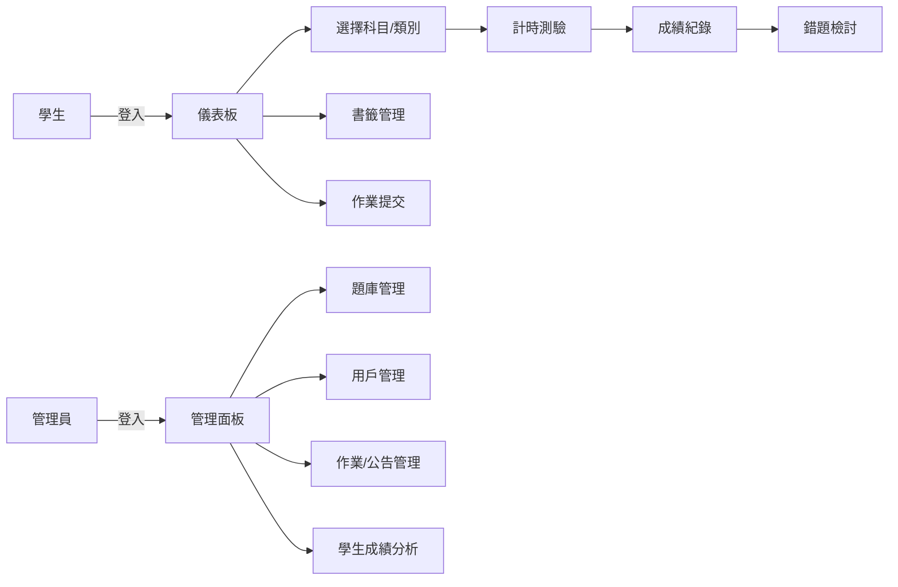
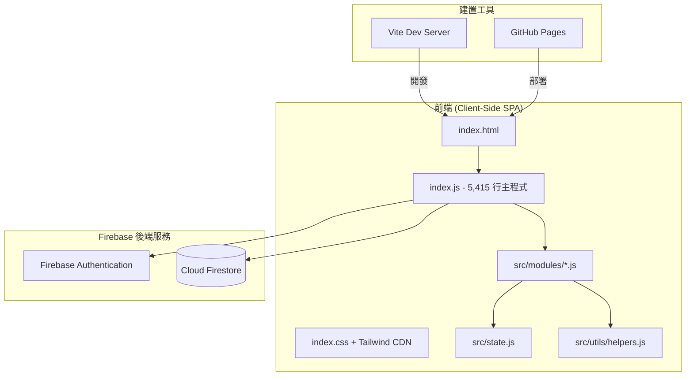
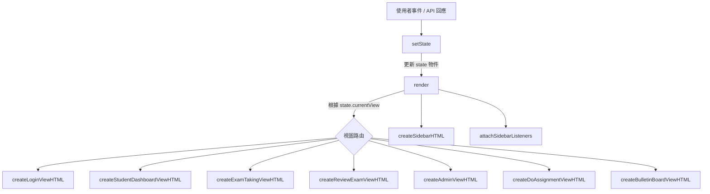
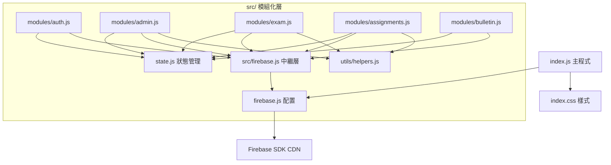
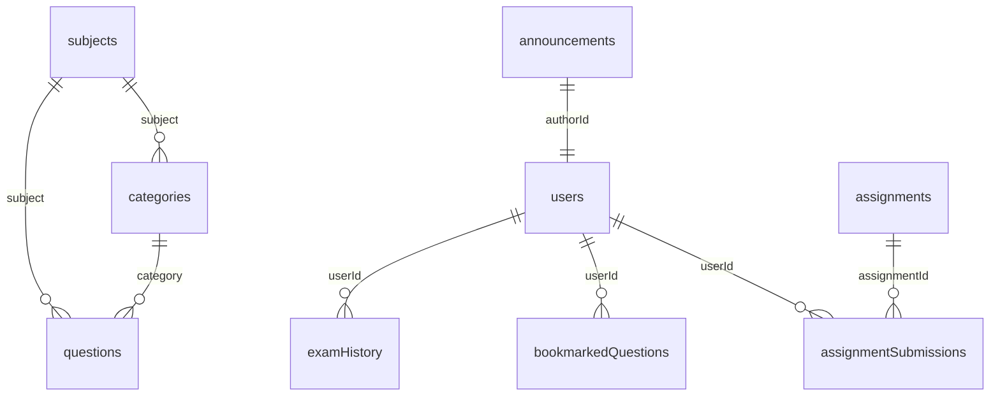
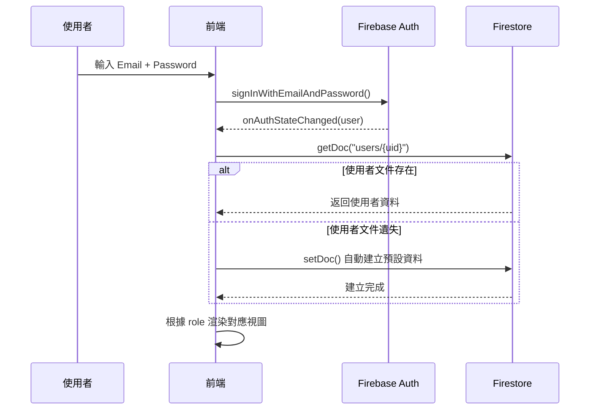
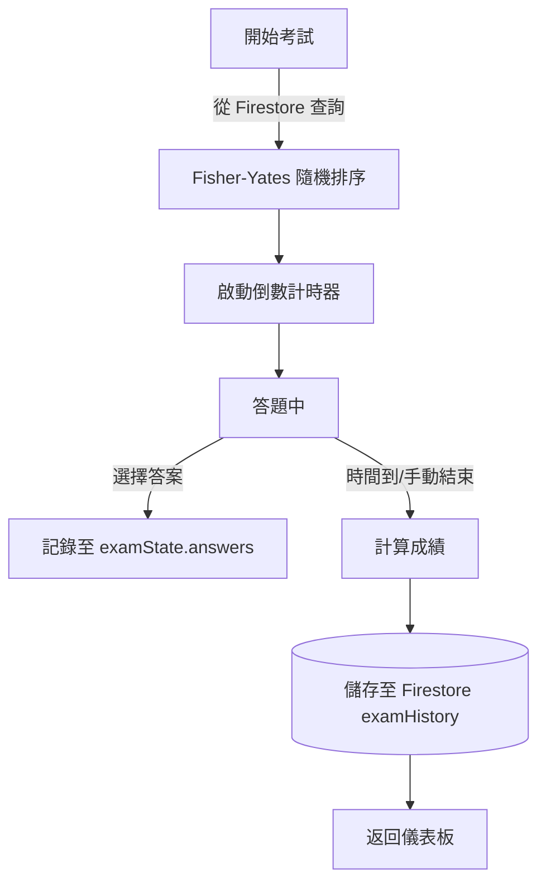

# 📋 PRD — 藥師國考系統 產品規格報告

> **專案名稱**：ExamPilot 2.0 — 藥師國考線上練習系統  
> **版本**：v2.0  
> **最後更新**：2026-02-21  
> **部署平台**：GitHub Pages（前端）+ Firebase（後端服務）

---

## 📑 目錄

1. [產品概述](#1-產品概述)
2. [系統架構總覽](#2-系統架構總覽)
3. [前端架構](#3-前端架構)
4. [後端架構（Firebase）](#4-後端架構firebase)
5. [資料模型（Firestore Schema）](#5-資料模型firestore-schema)
6. [功能模組規格](#6-功能模組規格)
7. [角色與權限設計](#7-角色與權限設計)
8. [狀態管理機制](#8-狀態管理機制)
9. [UI/UX 設計規範](#9-uiux-設計規範)
10. [安全性規範](#10-安全性規範)
11. [部署與建置](#11-部署與建置)
12. [專案統計](#12-專案統計)
13. [已知限制與未來規劃](#13-已知限制與未來規劃)

---

## 1. 產品概述

### 1.1 目標
提供藥師國考考生一個線上模擬考試平台，支援分科分類練習、即時計時測驗、成績追蹤分析、書籤收藏、手寫作業提交與管理員後台管理等功能。

### 1.2 目標受眾
| 角色 | 說明 |
|------|------|
| **學生（Student）** | 藥師國考考生，進行模擬考試、檢討錯題、收藏書籤 |
| **管理員（Admin）** | 教師/系統管理者，管理題庫、科目、用戶與作業評分 |

### 1.3 核心使用情境



---

## 2. 系統架構總覽

### 2.1 高層架構圖



### 2.2 技術棧

| 層級 | 技術 | 版本 |
|------|------|------|
| 前端框架 | Vanilla JavaScript (ES Module) | ES2022+ |
| CSS 框架 | TailwindCSS (CDN) + 自訂 CSS | CDN latest |
| 字體 | Google Fonts (Quicksand, Montserrat, Cormorant Garamond) | — |
| 圖示 | Material Symbols Outlined | — |
| 認證服務 | Firebase Authentication (Email/Password) | v9.15.0 |
| 資料庫 | Cloud Firestore | v9.15.0 |
| 建置工具 | Vite | v6.2.0 |
| 部署 | GitHub Pages (gh-pages) | v6.3.0 |
| 語言支援 | TypeScript (型別檢查, tsconfig) | v5.8.2 |

---

## 3. 前端架構

### 3.1 檔案結構

```
考試系統測試區(上線版)/
├── index.html              # 主 HTML 頁面（SPA 入口）
├── index.js                # 主程式 (5,415 行)
├── index.css               # 自訂樣式表 (~2,300 行)
├── firebase.js             # Firebase 配置與匯出 (80 行)
├── package.json            # npm 專案定義
├── vite.config.ts          # Vite 建置配置
├── tsconfig.json           # TypeScript 配置
├── metadata.json           # 專案元資料
├── src/
│   ├── firebase.js         # Firebase 模組中繼層 (29 行)
│   ├── state.js            # 全域狀態管理模組 (157 行)
│   ├── modules/
│   │   ├── admin.js        # 管理員功能 (727 行)
│   │   ├── assignments.js  # 作業系統 (214 行)
│   │   ├── auth.js         # 認證模組 (58 行)
│   │   ├── bulletin.js     # 公告板模組 (82 行)
│   │   └── exam.js         # 考試邏輯 (214 行)
│   └── utils/
│       └── helpers.js      # 共用工具函數 (82 行)
└── Images/                 # 圖片資源目錄
```

### 3.2 渲染架構

本專案採用 **Client-Side SPA**（單頁應用）架構，以 `state` 物件驅動 UI 渲染：



### 3.3 主要視圖列表

| 視圖名稱 | 函數 | 行數範圍 | 說明 |
|----------|------|----------|------|
| 登入頁 | `createLoginViewHTML()` | L1508-1617 | Email/Password 登入表單 |
| 學生儀表板 | `createStudentDashboardViewHTML()` | L1818-2135 | 成績總覽、雷達圖、趨勢圖 |
| 考試選擇 | `createExamSelectionViewHTML()` | L2137-2169 | 科目與類別選擇 |
| 計時考試 | `createExamTakingViewHTML()` | L2171-2318 | 即時計時、答題介面 |
| 考試檢討 | `createReviewExamViewHTML()` | L2320-2433 | 錯題檢視與詳解 |
| 管理面板 | `createAdminViewHTML()` | L2435-3014 | 科目/類別/題目/用戶管理 |
| 作業列表 | `createHandwrittenAssignmentListViewHTML()` | L3016-3052 | 學生作業列表 |
| 作業作答 | `createDoAssignmentViewHTML()` | L3054-3265 | 富文字編輯器作答 |
| 管理員作業 | `createAdminAssignmentViewsHTML()` | L3267-3527 | 作業出題、評分、檢視 |
| 公告板 | `createBulletinBoardViewHTML()` | L3529-3601 | 公告列表與管理 |
| 側邊欄 | `createSidebarHTML()` | L1380-1506 | 導航選單 |
| 雷達圖 | `createRadarChartView()` | L1619-1675 | 各科成績雷達圖 |
| 成績趨勢圖 | `createScoreTrendChart()` | L1677-1783 | 歷次考試趨勢折線圖 |

### 3.4 模組依賴關係



> [!NOTE]
> `index.js` 主程式包含完整的業務邏輯（單體式），`src/modules/` 為已模組化的副本。
> 兩者功能重疊，目前 `index.js` 為實際運作的進入點。

---

## 4. 後端架構（Firebase）

### 4.1 使用的 Firebase 服務

| 服務 | 用途 | SDK 版本 |
|------|------|----------|
| **Firebase Authentication** | Email/Password 使用者認證 | v9.15.0 (Modular) |
| **Cloud Firestore** | NoSQL 文件資料庫 | v9.15.0 (Modular) |

### 4.2 Firebase 專案資訊

| 項目 | 值 |
|------|-----|
| 專案 ID | `upgradeexam-1623f` |
| Auth Domain | `upgradeexam-1623f.firebaseapp.com` |
| Storage Bucket | `upgradeexam-1623f.firebasestorage.app` |

### 4.3 Firebase SDK 匯入方法

使用 ES Module 從 CDN 直接匯入（非 npm 安裝方式）：

```javascript
import { initializeApp } from "https://www.gstatic.com/firebasejs/9.15.0/firebase-app.js";
import { getAuth, ... } from "https://www.gstatic.com/firebasejs/9.15.0/firebase-auth.js";
import { getFirestore, ... } from "https://www.gstatic.com/firebasejs/9.15.0/firebase-firestore.js";
```

### 4.4 使用的 Firestore API 方法

| 方法 | 用途 |
|------|------|
| `collection()` | 取得集合參照 |
| `doc()` | 取得文件參照 |
| `getDoc()` / `getDocs()` | 讀取單一/多筆文件 |
| `addDoc()` | 新增文件（自動產生 ID）|
| `setDoc()` | 設定文件（指定 ID）|
| `updateDoc()` | 更新文件欄位 |
| `deleteDoc()` | 刪除文件 |
| `query()` + `where()` | 查詢條件篩選 |
| `writeBatch()` | 批次寫入操作 |
| `onSnapshot()` | 即時監聽文件變更 |
| `getCountFromServer()` | 伺服器端計數（不下載文件，只回傳數量）|

---

## 5. 資料模型（Firestore Schema）

### 5.1 集合總覽



### 5.2 各集合欄位定義

#### `users` — 使用者資料
| 欄位 | 類型 | 必填 | 說明 |
|------|------|------|------|
| `email` | String | ✅ | 登入用 Email |
| `name` | String | ✅ | 顯示名稱 |
| `role` | String | ✅ | 角色：`admin` / `student` |
| `createdAt` | String (ISO) | ✅ | 建立時間 |

#### `subjects` — 科目
| 欄位 | 類型 | 必填 | 說明 |
|------|------|------|------|
| `name` | String | ✅ | 科目名稱（唯一）|
| `description` | String | ✅ | 科目描述 |

#### `categories` — 類別（章節）
| 欄位 | 類型 | 必填 | 說明 |
|------|------|------|------|
| `name` | String | ✅ | 類別名稱 |
| `subject` | String | ✅ | 所屬科目名稱 |
| `timeLimit` | Number | ✅ | 考試時間限制（分鐘）|

#### `questions` — 題目
| 欄位 | 類型 | 必填 | 說明 |
|------|------|------|------|
| `subject` | String | ✅ | 所屬科目 |
| `category` | String | ✅ | 所屬類別 |
| `text` | String | ✅ | 題目內容 |
| `options` | Array\<String\> | ✅ | 四個選項文字 |
| `optionImages` | Array\<String\> | ❌ | 選項圖片路徑 |
| `answer` | String | ✅ | 正確答案文字 |
| `explanation` | String | ❌ | 詳解文字 |
| `explanationImage` | String | ❌ | 詳解圖片路徑 |
| `imgurl` | String | ❌ | 題目圖片路徑 |
| `createdAt` | String (ISO) | ✅ | 建立時間 |

#### `examHistory` — 考試紀錄
| 欄位 | 類型 | 必填 | 說明 |
|------|------|------|------|
| `userId` | String | ✅ | 使用者 ID |
| `subject` | String | ✅ | 考試科目 |
| `category` | String | ✅ | 考試類別 |
| `score` | Number | ✅ | 考試分數 (0-100) |
| `totalQuestions` | Number | ✅ | 總題數 |
| `correctCount` | Number | ✅ | 答對題數 |
| `answers` | Object | ✅ | 各題選擇 `{ questionId: optionIndex }` |
| `questions` | Array\<String\> | ✅ | 題目 ID 列表 |
| `date` | String (ISO) | ✅ | 考試日期 |

#### `bookmarkedQuestions` — 書籤收藏
| 欄位 | 類型 | 必填 | 說明 |
|------|------|------|------|
| `userId` | String | ✅ | 使用者 ID |
| `questionId` | String | ✅ | 題目 ID |
| `createdAt` | String (ISO) | ✅ | 收藏時間 |

#### `assignments` — 手寫作業
| 欄位 | 類型 | 必填 | 說明 |
|------|------|------|------|
| `title` | String | ✅ | 作業標題 |
| `subject` | String | ✅ | 所屬科目 |
| `category` | String | ❌ | 所屬類別 |
| `questions` | Array\<Object\> | ✅ | 題目列表 `[{ text, image, score }]` |
| `maxScore` | Number | ✅ | 滿分分數 |
| `createdAt` | String (ISO) | ✅ | 建立時間 |

#### `assignmentSubmissions` — 作業提交
| 欄位 | 類型 | 必填 | 說明 |
|------|------|------|------|
| `assignmentId` | String | ✅ | 作業 ID |
| `userId` | String | ✅ | 提交者 ID |
| `userName` | String | ✅ | 提交者名稱 |
| `answers` | Array\<String\> | ✅ | 各題 HTML 內容 |
| `status` | String | ✅ | 狀態：`draft` / `submitted` / `graded` |
| `score` | Number | ❌ | 後台評分分數 |
| `feedback` | String | ❌ | 評分回饋 |
| `feedbackImageUrl` | String | ❌ | 回饋圖片 |
| `createdAt` | String (ISO) | ✅ | 首次提交時間 |
| `updatedAt` | String (ISO) | ✅ | 最近更新時間 |
| `gradedAt` | String (ISO) | ❌ | 評分時間 |

#### `announcements` — 公告
| 欄位 | 類型 | 必填 | 說明 |
|------|------|------|------|
| `title` | String | ✅ | 標題 |
| `content` | String | ✅ | 內容 |
| `isBold` | Boolean | ✅ | 是否粗體顯示 |
| `color` | String | ✅ | 顯示顏色 |
| `authorId` | String | ✅ | 發佈者 ID |
| `authorName` | String | ✅ | 發佈者名稱 |
| `createdAt` | String (ISO) | ✅ | 建立時間 |
| `updatedAt` | String (ISO) | ✅ | 更新時間 |

---

## 6. 功能模組規格

### 6.1 認證模組 (`auth.js`)

| 功能 | 函數 | 說明 |
|------|------|------|
| 登入 | `handleLogin(e)` | Email/Password 登入，含錯誤提示 |
| 登出 | `handleLogout()` | 清除監聽器後 signOut |
| 狀態監聽 | `onAuthStateChanged` | 自動偵測登入/登出，重建使用者資料 |

**認證流程：**


### 6.2 考試模組 (`exam.js`)

| 功能 | 函數 | 說明 |
|------|------|------|
| 開始考試 | `startExam(subject, categoryName)` | **懶載入**：從 Firestore 即時查詢該科目+類別題目 → Fisher-Yates 隨機排序 → 啟動計時器 |
| 選擇答案 | `handleAnswerSelection(questionId, optionIndex)` | 記錄學生答案 |
| 題目導航 | `handleQuestionNavigation(direction)` | 上一題 / 下一題 |
| 跳題 | `handleJumpToQuestion(index)` | 跳至指定題號 |
| 書籤切換 | `handleBookmarkToggle(questionId)` | 新增/移除書籤收藏 |
| 完成考試 | `handleFinishExam()` | 計算成績 → 儲存至 Firestore → 顯示分數 |

**考試資料流：**


### 6.3 管理員模組 (`admin.js`)

#### 科目管理
| 功能 | 函數 | 說明 |
|------|------|------|
| 新增科目 | `handleAddSubject(e)` | 驗證重複 → 建立文件 → 本地排序更新 |
| 刪除科目 | `handleDeleteSubject(id, name)` | 確認 → 批次刪除類別 → 更新 state |

#### 類別管理
| 功能 | 函數 | 說明 |
|------|------|------|
| 新增類別 | `handleAddCategory(e)` | 驗證重複 → 建立文件 → 本地排序更新 |
| 刪除類別 | `handleDeleteCategory(id, subjectName)` | 確認 → 刪除文件 → 更新 state |
| 更新類別 | `handleUpdateCategory(e)` | 更新類別 → 批次更新所有關聯題目與考試紀錄的 category 欄位 |

> [!IMPORTANT]
> `handleUpdateCategory` 使用 `writeBatch` 連鎖更新三個集合：
> 1. `categories` 文件本身
> 2. `questions` 中 `category === oldName` 的所有題目
> 3. `examHistory` 中 `category === oldName` 的所有考試紀錄

#### 題目管理
| 功能 | 函數 | 說明 |
|------|------|------|
| 更新題目 | `handleUpdateQuestion(e)` | 含類別重新分類功能 |
| 刪除題目 | `handleDeleteQuestion(id)` | 確認後刪除 |
| 批次上傳 | `handleBulkUpload()` | JSON 檔案批次寫入 Firestore |
| 手動新增 | `handleAddQuestion(e)` | 含 4 選項 + 圖片 + 詳解 |

#### 用戶管理
| 功能 | 函數 | 說明 |
|------|------|------|
| 更新用戶 | `handleUpdateUser(e)` | 修改名稱 |
| 刪除用戶 | `handleDeleteUser(id)` | 級聯刪除：考試紀錄 + 書籤 + 作業提交 + 用戶文件 |
| 刪除考試紀錄 | `handleDeleteExamHistory(id)` | 刪除並重算雷達圖資料 |
| 刪除書籤 | `handleDeleteBookmark(questionId, userId)` | 支援管理員視角操作 |

### 6.4 作業模組 (`assignments.js`)

| 功能 | 函數 | 說明 |
|------|------|------|
| 新增作業 | `handleAddAssignment(e)` | 多題目支援，含圖片與配分 |
| 刪除作業 | `handleDeleteAssignment(id)` | 確認後刪除 |
| 學生提交 | `handleAssignmentSubmit(status)` | 支援草稿與正式提交 |
| 管理員評分 | `handleAdminGradeSubmission(e)` | 打分 + 回饋文字 + 回饋圖片 |

### 6.5 公告模組 (`bulletin.js`)

| 功能 | 函數 | 說明 |
|------|------|------|
| 新增/編輯公告 | `handleAddAnnouncement(e)` | 標題 + 內容 + 粗體 + 顏色 |
| 刪除公告 | `handleDeleteAnnouncement(id)` | 確認後刪除 |

### 6.6 工具函數 (`helpers.js`)

| 函數 | 說明 |
|------|------|
| `formatTime(seconds)` | 秒數 → `m:ss` 格式 |
| `sanitizeImagePath(path)` | 清理圖片路徑（反斜線 → 正斜線）|
| `calculateRadarData(examHistory)` | 計算各科平均分數（雷達圖資料）|
| `icons` | SVG 圖示常數物件（20+ 圖示）|

---

## 7. 角色與權限設計

### 7.1 角色矩陣

| 功能 | 學生 (Student) | 管理員 (Admin) |
|------|:-:|:-:|
| 登入/登出 | ✅ | ✅ |
| 個人儀表板 | ✅ | ❌ |
| 模擬考試 | ✅ | ❌ |
| 檢討考試 | ✅ | ❌ |
| 書籤收藏 | ✅ | ❌ |
| 提交作業 | ✅ | ❌ |
| 查看公告 | ✅ | ✅ |
| 管理面板 | ❌ | ✅ |
| 題庫 CRUD | ❌ | ✅ |
| 科目/類別管理 | ❌ | ✅ |
| 用戶管理 | ❌ | ✅ |
| 出題/評分作業 | ❌ | ✅ |
| 發佈公告 | ❌ | ✅ |
| 查看學生分析 | ❌ | ✅ |

### 7.2 權限判斷機制

```javascript
// Admin 判斷：email === 'admin@test.com' 或 Firestore role === 'admin'
if (userData.role === 'admin') {
    // 載入管理介面 + 所有學生 + 所有題目（全量載入）
} else {
    // 載入學生介面 + 個人資料（題目懶載入，不預先載入）
}
```

### 7.3 Firestore Security Rules（建議）

```javascript
rules_version = '2';
service cloud.firestore {
  match /databases/{database}/documents {
    function isSignedIn() { return request.auth != null; }
    function isAdmin() {
      return isSignedIn() && 
        get(/databases/$(database)/documents/users/$(request.auth.uid)).data.role == 'admin';
    }

    match /users/{userId} {
      allow read, write: if isSignedIn() && (request.auth.uid == userId || isAdmin());
    }
    match /examHistory/{docId} {
      allow read: if isSignedIn() && (resource.data.userId == request.auth.uid || isAdmin());
      allow create: if isSignedIn() && request.resource.data.userId == request.auth.uid;
    }
    match /questions/{qId} {
      allow read: if isSignedIn();
      allow write: if isAdmin();
    }
  }
}
```

---

## 8. 狀態管理機制

### 8.1 核心 State 物件

```javascript
let state = {
  // --- 全域 ---
  isLoading: false,
  isLoggedIn: false,
  currentUser: null,         // { id, email, name, role, examHistory, bookmarkedQuestions, radarChartData }
  loginError: "",
  loginAsRole: "student",
  currentView: "login",      // 路由控制

  // --- 資料 ---
  subjects: [],              // [{ id, name, description }]
  categories: {},            // { subjectName: [{ id, name, subject, timeLimit }] }
  allQuestions: [],           // 管理員：全量載入；學生：空陣列（懶載入，startExam 時才查詢）
  allStudents: [],            // 管理員用

  // --- 管理員 UI ---
  selectedAdminSubject: null,
  selectedAdminCategory: null,
  selectedStudentIdForAnalytics: null,
  selectedStudentAnalyticsData: null,
  editingQuestion: null,
  editingUser: null,
  editingCategory: null,

  // --- 考試 ---
  selectedExamSubject: null,
  examState: null,            // { subject, category, questions[], answers{}, currentQuestionIndex, startTime, timeLeft, timerInterval }
  reviewingExam: null,

  // --- 批次上傳 ---
  selectedBulkUploadSubject: null,
  selectedBulkUploadCategory: null,
  selectedFile: null,
  uploadStatus: "idle",
  uploadMessage: "",

  // --- 書籤 ---
  viewingBookmark: null,
  selectedBookmarkFilterSubject: null,

  // --- 作業 ---
  assignments: [],
  currentAssignment: null,
  assignmentSubmissions: [],
  submissionDraft: null,
  gradingSubmission: null,

  // --- 公告 ---
  announcements: [],
  editingAnnouncement: null,
};
```

### 8.2 setState 智慧行為

`setState()` 並非單純合併，還包含以下自動連鎖邏輯：

| 觸發條件 | 自動行為 |
|----------|---------|
| `selectedAdminSubject` 改變 | 重設 `selectedAdminCategory = null` |
| `selectedBulkUploadSubject` 改變 | 重設 category / file / uploadStatus |
| `selectedManualSubject` 改變 | 重設 `selectedManualCategory = null` |
| 離開 `exam-taking` 視圖 | 清除 `timerInterval`，重設 `examState` |
| 離開 `student-analytics` 視圖 | 清除 `adminStudentHistoryListener` |

### 8.3 即時監聽

| 監聽器 | 目標 | 說明 |
|--------|------|------|
| `examHistoryListener` | 學生考試紀錄 | 登入時啟動，即時同步 examHistory |
| `adminStudentHistoryListener` | 管理員查看特定學生 | 進入學生分析頁時啟動 |

---

## 9. UI/UX 設計規範

本系統採用**雙主題設計**：登入頁為暗色 Luxury 風格，主應用為淺色 Cozy 風格，兩者透過不同的 CSS 變數體系實現。

### 9.1 設計語言概覽

| 項目 | 設定 |
|------|------|
| 設計風格 | Cozy Study（溫暖、柔和、專注閱讀感）|
| 框架層 | TailwindCSS CDN + 自訂 CSS 變數 (`index.css` `:root`) |
| 圖示系統 | Material Symbols Outlined (Google Fonts CDN) |
| 背景圖案 | 微點 `radial-gradient(#f3e6d8 1px, transparent 1px)` 24px 間距 |
| 毛玻璃效果 | `.glass-panel` — `rgba(255,255,255,0.85)` + `backdrop-filter: blur(12px)` |
| 選取文字 | `selection:bg-peach/20 selection:text-coffee` |

---

### 9.2 色彩系統

#### 主應用色彩（Tailwind 擴展 + CSS 變數）

| Token | 色碼 | 用途 |
|-------|------|------|
| `cream` | `#fffcf7` | 頁面背景底色 |
| `cream-dark` | `#f0e6da` | 次要背景、捲軸拇指 |
| `peach` | `#ffaa8e` | 主要強調色、CTA 按鈕 |
| `peach-hover` | `#e67a5b` | Peach hover 狀態 |
| `coffee` | `#5c4b43` | 主文字色 |
| `coffee-light` | `#8d7a71` | 次要文字、副標題 |
| `sage` | `#b5d6b0` | 成功/正向提示、Logo 背景 |
| `sage-dark` | `#88a684` | Sage 深色變體 |
| `sky` | `#b8dbe8` | 資訊提示 |
| `lavender` | `#d8c2e6` | 裝飾色 |
| `sun` | `#ffd978` | 警告色、裝飾動畫（太陽 icon）|

#### CSS 變數色彩（`:root`，用於 `index.css` 元件）

| 變數 | 色碼 | 用途 |
|------|------|------|
| `--bg-color` | `#f7f9f8` | 全域背景 |
| `--card-bg` | `#ffffff` | 卡片背景 |
| `--primary-color` | `#a3c1ad` | 主色（按鈕、進度條、Logo）|
| `--primary-color-dark` | `#87a793` | 主色深色（hover 狀態）|
| `--text-color` | `#333333` | 主文字 |
| `--text-light` | `#666666` | 次要文字 |
| `--border-color` | `#e8edea` | 邊框、分隔線 |
| `--danger-color` | `#e57373` | 危險操作 |
| `--correct-color` | `#4caf50` | 答對 |
| `--incorrect-color` | `#f44336` | 答錯 |
| `--status-current` | `#2196f3` | 當前題目 |
| `--status-answered` | `#4caf50` | 已答題 |
| `--status-bookmarked` | `#ffc107` | 已收藏 |

#### Luxury 暗色模式調色盤（登入頁 + 深色模式）

| Token | 色碼 | 用途 |
|-------|------|------|
| `luxury-black` | `#1C1917` | 登入頁背景底色 |
| `luxury-dark` | `#44403C` | 次要暗色 |
| `luxury-gold` | `#CA8A04` | 金色強調 |
| `luxury-gold-light` | `#EAB308` | 金色高亮 |
| `luxury-bg` | `#0a0a0a` / `#FAFAF9` | 深/淺模式背景 |
| `luxury-border` | `rgba(202,138,4,0.2)` | 金色邊框 |
| `luxury-muted` | `#a8a29e` | 暗色模式次要文字 |

> [!NOTE]
> 深色模式透過 HTML `class="light"` + Tailwind `darkMode: "class"` 切換。
> 登入頁始終使用暗色 Luxury 風格，與主應用的淺色風格獨立。

---

### 9.3 字體系統

| 字體名稱 | Tailwind Token | 用途 | 來源 |
|----------|----------------|------|------|
| **Quicksand** | `font-display`, `font-sans` | UI 標題、按鈕、導航 | Google Fonts |
| **Montserrat** | `font-luxury-body` | 內文、說明文字 | Google Fonts |
| **Cormorant Garamond** | `font-luxury` | 裝飾性標題（Luxury 風格）| Google Fonts |
| **Noto Sans TC** | `--font-family` | CSS 變數中的預設字體 | Google Fonts |

**字級規範（常用）：**

| 語境 | 字級 | 字重 |
|------|------|------|
| 頁面大標題 | `text-2xl` ~ `text-3xl` (24-30px) | `font-bold` (700) |
| 卡片標題 | 18-22px | 700 |
| 內文 | 14-16px | 400-500 |
| 輔助文字 | 12-13px | 500 |
| 統計數字 | 36px | 700 |

---

### 9.4 陰影系統

#### Tailwind 擴展陰影（`index.html` config）

| Token | 定義 | 適用場景 |
|-------|------|----------|
| `shadow-soft` | `0 8px 30px rgba(92,75,67,0.05)` | 側邊欄、大面積容器 |
| `shadow-card` | `0 4px 20px rgba(92,75,67,0.04)` | 一般卡片 |
| `shadow-float` | `0 10px 40px -10px rgba(92,75,67,0.1)` | 浮動元素 |
| `shadow-inner-soft` | `inset 0 2px 4px rgba(92,75,67,0.03)` | 輸入框、嵌入區域 |
| `shadow-luxury-glow` | `0 0 60px rgba(202,138,4,0.15)` | Luxury 模式發光效果 |
| `shadow-luxury-card` | `0 25px 50px -12px rgba(0,0,0,0.15)` | Luxury 模式卡片 |

#### CSS 變數陰影

| 適用元素 | 效果 |
|----------|------|
| 卡片 (`.subject-card`, `.detail-card`) | `0 4px 6px var(--shadow-color)` |
| 卡片 hover | `0 8px 12px var(--shadow-color)` + `translateY(-4px)` |
| 登入按鈕 hover | `0 10px 20px rgba(245,158,11,0.3)` + `translateY(-2px)` |
| Logo icon | `0 4px 20px rgba(251,191,36,0.3)` |

---

### 9.5 圓角系統

| Tailwind Token | 值 | 常用場景 |
|----------------|-----|----------|
| `rounded-lg` | 8px | 按鈕、輸入框、Badge |
| `rounded-xl` | 1rem (16px) | 卡片、側邊欄按鈕 |
| `rounded-2xl` | 1.5rem (24px) | 大卡片、Header 元件 |
| `rounded-3xl` | 2rem (32px) | 特殊裝飾容器 |
| `rounded-4xl` | 2.5rem (40px) | 大型裝飾元素 |
| `rounded-full` | 50% | 頭像、通知圓點、Action 按鈕 |

---

### 9.6 頁面佈局

#### 整體 SPA 結構

```
┌─────────────────────────────────────────────────────┐
│ body (flex, h-screen, overflow-hidden)              │
│ ┌──────────┬──────────────────────────────────────┐  │
│ │ Sidebar  │  Main Area                          │  │
│ │ (w-72)   │  ┌────────────────────────────────┐ │  │
│ │ 固定式    │  │ Header (sticky, bg-white/40)   │ │  │
│ │ glass-   │  │ 時鐘 + 通知 + 登出             │ │  │
│ │ panel    │  ├────────────────────────────────┤ │  │
│ │          │  │ Content (flex-1, overflow-y)   │ │  │
│ │          │  │ #main-content-container        │ │  │
│ │          │  │ px-4 md:px-8 pb-8              │ │  │
│ │          │  └────────────────────────────────┘ │  │
│ └──────────┴──────────────────────────────────────┘  │
└─────────────────────────────────────────────────────┘
```

#### 登入頁佈局（Split Layout）

```
┌──────────────────┬────────────────────────┐
│ Left Panel       │ Right Panel            │
│ (flex: 1)        │ (flex: 1.2)            │
│ 登入表單          │ 背景圖片               │
│ 暗色 (#1c1917)    │ cozy_study_night.png   │
│ 最大寬度 420px     │ 行動裝置隱藏           │
│                  │ 雙層 overlay 遮罩       │
└──────────────────┴────────────────────────┘
```

#### Grid 佈局規範

| Grid 容器 | 欄位設定 | 用途 |
|-----------|----------|------|
| `.subjects-grid` | `repeat(auto-fill, minmax(320px, 1fr))` | 科目選擇卡片 |
| `.category-grid` | `repeat(auto-fill, minmax(250px, 1fr))` | 類別選擇卡片 |
| `.stats-grid` | `repeat(auto-fit, minmax(200px, 1fr))` | 儀表板統計卡片 |
| `.dashboard-details-grid` | `repeat(auto-fit, minmax(400px, 1fr))` | 儀表板詳情區塊 |
| `.management-grid` | `repeat(auto-fit, minmax(400px, 1fr))` | 管理面板 |

---

### 9.7 元件設計規範

#### 按鈕樣式

| 類型 | 樣式特徵 | 範例 Class |
|------|----------|------------|
| **主要按鈕** | 實心 `--primary-color` 背景、白色文字、8px 圓角 | `.login-button`, `.submit-button` |
| **CTA 按鈕（登入頁）** | 漸層 `#d97706 → #fbbf24`、12px 圓角、hover 浮起 | `.cozy-submit-btn` |
| **描邊按鈕** | 透明背景 + `--primary-color-dark` 邊框、hover 填滿色 | `.review-button` |
| **圖示按鈕** | 圓形 32px、1px border、hover 變色 | `.action-btn` |
| **Header 按鈕** | 方形 w-12 h-12、白色背景、2xl 圓角 | `#header-logout-btn` |
| **危險按鈕** | `--danger-color` 色系 | `.action-btn.delete` |
| **停用狀態** | `background: #ccc`、`cursor: not-allowed` | `:disabled` |

#### 卡片樣式

| 特徵 | 值 |
|------|-----|
| 背景 | `var(--card-bg)` (#ffffff) |
| 邊框 | `1px solid var(--border-color)` |
| 圓角 | 12px |
| 陰影 | `0 4px 6px var(--shadow-color)` |
| Hover | `translateY(-4px)` + 加深陰影 |
| 間距 | `padding: 24px` |

#### 表單元件

| 元素 | 規範 |
|------|------|
| Input padding | 10-14px 14-18px |
| Input 圓角 | 8-12px |
| Focus 效果 | border 變 `--primary-color` + `box-shadow: 0 0 0 3px var(--badge-bg)` |
| Label | 14px、font-weight 500-600 |
| Select 下拉 | 自訂箭頭 SVG、`appearance: none` |

#### Badge 標籤

| 類型 | 背景 | 文字色 | 圓角 |
|------|------|--------|------|
| 科目 Badge | `var(--badge-bg)` (#e8f0eb) | `var(--badge-text)` (#507661) | 12-16px |
| 類別 Badge | `#eef3f8` | `#4a6a8b` | 12px |
| Admin Badge | `rgba(220,38,38,0.2)` | `#f87171` | 100px |

---

### 9.8 動畫效果

#### 自訂 CSS 動畫 (`@keyframes`)

| 動畫名稱 | 效果 | 適用場景 |
|----------|------|----------|
| `spin` | 360° 旋轉 | Loading spinner |
| `fadeIn` | 透明度 0→1 + Y 軸位移 10px→0 | 登入頁進場、圖表繪製 |
| `slideInLeft` | X 軸 -100%→0 | 行動端側邊欄滑入 |
| `pulse-timer` | 縮放 1→1.05→1 | 考試計時器脈動 |
| `drawLine` | `stroke-dashoffset` 動畫 | SVG 趨勢圖線條繪製 |
| `popIn` | 縮放 0→1.1→1 | SVG 圖表數據點彈出 |

#### Tailwind 預設動畫

| 動畫 | 適用場景 |
|------|----------|
| `animate-spin` | Loading indicator |
| `animate-pulse` | 太陽 icon 脈動 |
| `animate-bounce` | 通知鈴鐺 hover |

#### Transition 慣例

| 屬性 | 時長 | 曲線 |
|------|------|------|
| 背景/邊框色 | `0.2s` | `ease` (預設) |
| 全屬性 (all) | `0.3s` | `ease` |
| 進度條寬度 | `0.5s` | `ease-in-out` |
| 卡片浮起 | `0.2s` | `ease` |

---

### 9.9 捲軸樣式

| Class | 效果 |
|-------|------|
| `.custom-scrollbar` | 6px 寬、透明軌道、`#f0e6da` 拇指、hover 變 `#ffaa8e` |
| `.no-scrollbar` | 完全隱藏捲軸（webkit + Firefox）|

---

### 9.10 互動回饋

| 情境 | 回饋方式 |
|------|---------| 
| API 請求中 | 全域 Loading Spinner overlay（`#loading-indicator`，z-index 9999）|
| 操作成功 | `alert()` 成功訊息 |
| 操作失敗 | `alert()` 錯誤訊息 + `console.error()` |
| 危險操作 | `confirm()` 二次確認 |
| 答題中 | 即時倒數計時器 + `pulse-timer` 動畫 |
| 按鈕 hover | 背景色變深 或 `translateY(-2px)` 浮起 |
| 卡片 hover | `translateY(-4px)` + 陰影加深 |
| Admin 按鈕 hover | icon 變色（編輯→綠、刪除→紅）|

---

### 9.11 響應式設計

#### 斷點定義

| 斷點 | 寬度 | 觸發行為 |
|------|------|----------|
| 手機 | `≤ 480px` | 壓縮 padding、隱藏次要元素 |
| 平板 | `≤ 768px` | 側邊欄隱藏 → Overlay 抽屜選單 (`#mobile-sidebar-overlay`) |
| 小桌面 | `≤ 900px` | 考試導航面板 (`exam-nav-panel`) 隱藏或堆疊 |
| 桌面 | `≤ 1024px` | 作業系統佈局調整 |
| 大桌面 | `> 1024px` | 完整佈局，固定側邊欄 (`w-72` = 288px) |

#### 行動端特殊處理

- 側邊欄：`hidden md:flex` → 行動端用 `#mobile-sidebar-overlay`（`w-80`，`bg-black/50` 遮罩）
- Header 標題：`text-base sm:text-xl md:text-2xl lg:text-3xl` 漸進式字級
- 副標題：`hidden sm:block` 在小螢幕隱藏
- 登入頁右面板圖片：`display: none` → `md` 時顯示

---

### 9.12 Z-Index 層級

| 層級 | z-index | 元素 |
|------|---------|------|
| Loading Overlay | `9999` | `#loading-indicator` |
| Modal 容器 | `1000` | `#modal-container` |
| Mobile Sidebar | `50` | `#mobile-sidebar-overlay` |
| Sidebar | `20` | 桌面側邊欄 |
| Header | `10` | 主內容 Header |
| Admin Toggle | `50` | 登入頁管理員切換按鈕 |

---

## 10. 安全性規範

### 10.1 現有措施

| 項目 | 狀態 | 說明 |
|------|------|------|
| Firebase Auth 認證 | ✅ | Email/Password 登入 |
| 角色驗證 | ✅ | Firestore `role` 欄位判斷 |
| 使用者資料自動修復 | ✅ | Auth 存在但 Firestore 缺失時自動重建 |
| 圖片路徑消毒 | ✅ | `sanitizeImagePath()` 清理反斜線 |
| useState 隔離 | ✅ | 學生只能操作自己的資料 |

### 10.2 注意事項

> [!WARNING]
> - Firebase 配置金鑰目前直接寫在 `firebase.js` 中（前端公開金鑰，安全性依賴 Firestore Security Rules）
> - 前端使用 `innerHTML` 處理作業提交內容，有潛在 XSS 風險
> - Admin 帳號判斷依賴 Firestore 中的 `role` 欄位，需確保 Security Rules 正確配置

---

## 11. 部署與建置

### 11.1 開發環境

```bash
# 安裝依賴
npm install

# 啟動開發伺服器 (port 3000)
npm run dev
```

### 11.2 建置與部署

```bash
# 建置生產版本
npm run build

# 部署至 GitHub Pages
npm run deploy
```

### 11.3 Vite 配置重點

| 設定 | 值 | 說明 |
|------|-----|------|
| `server.port` | 3000 | 開發伺服器埠號 |
| `base` | `./` | 相對路徑（GitHub Pages 相容）|
| `define` | `process.env.GEMINI_API_KEY` | 環境變數注入 |
| `resolve.alias` | `@` → 專案根目錄 | 路徑別名 |

---

## 12. 專案統計

### 12.1 程式碼規模

| 檔案 | 行數 | 大小 |
|------|------|------|
| `index.js` (主程式) | 5,415 | ~255 KB |
| `index.css` (樣式) | ~2,300 | ~71 KB |
| `index.html` | 238 | ~9.5 KB |
| `firebase.js` | 82 | ~2 KB |
| `src/state.js` | 157 | ~4 KB |
| `src/modules/admin.js` | 727 | ~21 KB |
| `src/modules/exam.js` | 214 | ~6 KB |
| `src/modules/assignments.js` | 214 | ~6 KB |
| `src/modules/bulletin.js` | 82 | ~2 KB |
| `src/modules/auth.js` | 58 | ~2 KB |
| `src/utils/helpers.js` | 82 | ~10 KB |
| **合計** | **~9,567** | **~388 KB** |

### 12.2 函數統計

| 模組 | 函數數量 |
|------|----------|
| 主程式 `index.js` | 160+ |
| `admin.js` | 14 |
| `exam.js` | 7 |
| `assignments.js` | 4 |
| `auth.js` | 2 |
| `bulletin.js` | 2 |
| `helpers.js` | 3 + 1 (icons 物件) |

---

## 13. 已知限制與未來規劃

### 13.1 已知限制

| 項目 | 說明 |
|------|------|
| ⚠️ 單體式主程式 | `index.js` 超過 5,000 行，`src/modules/` 已開始模組化但尚未完全切換 |
| ⚠️ 無自動化測試 | 目前無任何單元測試或 E2E 測試 |
| ⚠️ 無離線支援 | 未實作 Service Worker / PWA |
| ✅ 題目懶載入（Phase 1）| 學生端已實作，startExam 時才從 Firestore 查詢題目 |
| ⚠️ 無完整分頁機制 | 管理面板仍全量載入，學生歷史紀錄尚未分頁 |
| ⚠️ 圖表為手繪 SVG | 雷達圖與趨勢圖以 JavaScript 動態產生 SVG，非使用圖表函式庫 |
| ⚠️ 即時通知缺失 | 通知按鈕為裝飾性，無實際推播功能 |

### 13.2 未來規劃建議

| 優先序 | 項目 | 說明 |
|--------|------|------|
| 🔴 P0 | 完成模組化遷移 | 將 `index.js` 主程式完全遷移至 `src/modules/` |
| 🔴 P0 | 新增自動化測試 | 至少涵蓋核心考試流程與管理員操作 |
| 🟡 P1 | PWA 支援 | Service Worker + 離線存取 |
| 🟡 P1 | 分頁與虛擬滾動 | 管理面板題庫分頁 + 學生歷史紀錄分頁（Phase 2-3）|
| 🟡 P1 | 即時通知系統 | Firebase Cloud Messaging 推播 |
| 🟢 P2 | Google 登入 | Firebase `GoogleAuthProvider` |
| 🟢 P2 | 多角色擴充 | 支援助教 (TA) 角色 |
| 🟢 P2 | 圖表函式庫 | 導入 Chart.js 或 ECharts 取代手繪 SVG |
| 🟢 P2 | 題目匯出 | 支援 PDF / Excel 匯出功能 |
| 🟢 P2 | 使用者狀態管理 | `status: active / banned` 欄位 |

---

> **本文件由系統自動產生，基於專案原始碼分析。最後更新：2026-02-19**
