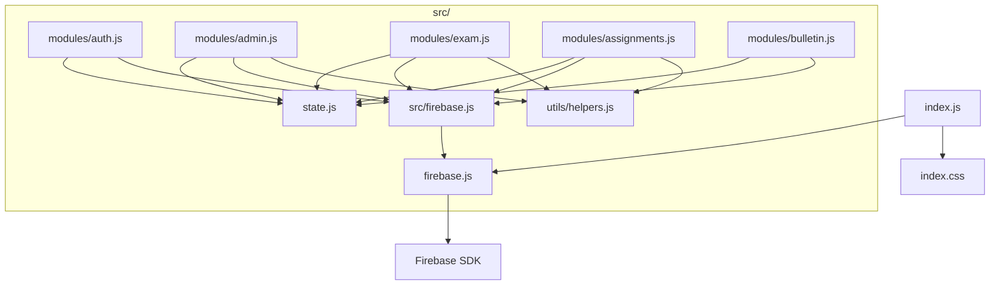

# 📖 專案程式碼導覽地圖

此文件幫助快速定位專案中各檔案的程式碼區塊與功能模組。

---

## 📊 專案統計

| 項目 | 數量 |
|------|------|
| **主程式 index.js** | 5,200 行 |
| **主程式函數** | 160+ |
| **模組化檔案** | 7 個 |
| **樣式表 index.css** | ~2,300 行 |

---

## 📁 專案結構

```
考試系統測試區(上線版)/
├── index.html          # 主 HTML 頁面
├── index.js            # 主程式 (5200 行)
├── index.css           # 主樣式表
├── firebase.js         # Firebase 配置與匯出 (82 行)
├── metadata.json       # 專案元資料
├── src/
│   ├── firebase.js     # Firebase 模組中繼層 (29 行)
│   ├── state.js        # 全域狀態管理模組 (157 行)
│   ├── modules/
│   │   ├── admin.js        # 管理員功能 (727 行)
│   │   ├── assignments.js  # 作業系統 (214 行)
│   │   ├── auth.js         # 認證模組 (58 行)
│   │   ├── bulletin.js     # 公告板模組 (82 行)
│   │   └── exam.js         # 考試邏輯 (214 行)
│   └── utils/
│       └── helpers.js      # 共用工具函數 (82 行)
└── Images/             # 圖片資源目錄
```

---

## 🔥 firebase.js (82 行)

Firebase 配置與初始化，匯出 auth、db 及所有 Firestore 方法。

| 行號 | 內容 |
|------|──────|
| L1-28 | Firebase SDK 匯入（含 `getCountFromServer`）|
| L30-40 | Firebase 配置常數 |
| L42-57 | Firebase 初始化 |
| L59-82 | 匯出 auth, db 及方法（含 `getCountFromServer`）|

---

## 📦 src/ 模組化檔案

### 🔄 src/state.js (157 行)

全域狀態管理模組。

| 行號 | 函數/內容 | 說明 |
|------|-----------|------|
| L13-57 | `state` | 全域應用程式狀態物件 |
| L60-66 | `setExamHistoryListener()` | 設定考試歷史監聽器 |
| L68-74 | `setAdminStudentHistoryListener()` | 設定管理員學生監聽器 |
| L79-85 | `setRenderFunction()` | 設定渲染函數參照 |
| L87-144 | `setState()` | 更新狀態並觸發重新渲染 |
| L146-156 | `setLoading()` | 設定載入狀態 |

**狀態新增項目:**
- `editingCategory` (L41) - 追蹤目前編輯的類別

---

### 🔐 src/modules/auth.js (58 行)

認證模組 - 登入/登出功能。

| 行號 | 函數 | 說明 |
|------|------|------|
| L15-39 | `handleLogin()` | 使用者登入處理 |
| L41-57 | `handleLogout()` | 使用者登出處理 |

---

### 📝 src/modules/exam.js (214 行)

考試邏輯模組 - 考試開始、答題、完成等功能。

| 行號 | 函數 | 說明 |
|------|------|------|
| L18-76 | `startExam()` | 開始考試 |
| L78-90 | `handleAnswerSelection()` | 處理答案選擇 |
| L92-104 | `handleQuestionNavigation()` | 處理題目導航 |
| L106-115 | `handleJumpToQuestion()` | 跳至指定題目 |
| L117-161 | `handleBookmarkToggle()` | 處理書籤切換 |
| L163 | `handleReviewBookmarkToggle` | 書籤切換別名 |
| L166-213 | `handleFinishExam()` | 完成考試並儲存成績 |

---

### 🛠️ src/modules/admin.js (709 行)

管理員功能模組 - 科目、類別、題目、用戶管理。

| 行號 | 函數 | 說明 |
|------|------|------|
| **科目管理** | | |
| L25-79 | `handleAddSubject()` | 新增科目 |
| L81-118 | `handleDeleteSubject()` | 刪除科目 |
| **類別管理** | | |
| L122-184 | `handleAddCategory()` | 新增類別 |
| L186-208 | `handleDeleteCategory()` | 刪除類別 |
| L210-218 | `openEditCategoryModal()` | 開啟編輯類別 Modal ⭐ |
| L220-222 | `closeEditCategoryModal()` | 關閉編輯類別 Modal ⭐ |
| L224-311 | `handleUpdateCategory()` | 更新類別並同步題目＋考試紀錄 ⭐🔥 |
| **題目管理** | | |
| L299-343 | `handleUpdateQuestion()` | 更新題目（含類別修改）⭐🔥 |
| L345-361 | `handleDeleteQuestion()` | 刪除題目 |
| L363-428 | `handleBulkUpload()` | 批次上傳題目 |
| L430-436 | `handleManualAddSubjectChange()` | 手動題目科目變更 |
| L438-444 | `handleManualAddCategoryChange()` | 手動題目類別變更 |
| L446-533 | `handleAddQuestion()` | 手動新增題目 |
| **用戶管理** | | |
| L537-560 | `handleUpdateUser()` | 更新用戶資料 |
| L562-616 | `handleDeleteUser()` | 刪除用戶 |
| L618-659 | `handleDeleteExamHistory()` | 刪除考試紀錄 |
| L661-709 | `handleDeleteBookmark()` | 刪除書籤 |

**⭐ 最新更新 (2026-02-18):**
- **類別名稱同步更新** 🔥: 修改類別名稱時自動批次更新所有相關題目的 category 欄位
- **考試紀錄同步更新** 🔥: 修改類別名稱時自動批次更新所有使用者的 examHistory category 欄位
- **編輯題目時修改類別** 🔥: 題目編輯功能新增類別選擇，可重新分類題目
- 類別編輯功能包含重複名稱驗證（排除自身）
- 自動排序並維護類別列表

---

### ✏️ src/modules/assignments.js (214 行)

作業系統模組 - 手寫作業功能。

| 行號 | 函數 | 說明 |
|------|------|------|
| L22-87 | `handleAddAssignment()` | 新增作業 |
| L89-105 | `handleDeleteAssignment()` | 刪除作業 |
| L107-171 | `handleAssignmentSubmit()` | 學生提交作業 |
| L173-213 | `handleAdminGradeSubmission()` | 管理員評分作業 |

---

### 📢 src/modules/bulletin.js (82 行)

公告板模組 - 公告的新增、編輯、刪除。

| 行號 | 函數 | 說明 |
|------|------|------|
| L18-64 | `handleAddAnnouncement()` | 新增或編輯公告 |
| L66-81 | `handleDeleteAnnouncement()` | 刪除公告 |

---

### 🧰 src/utils/helpers.js (82 行)

共用工具函數模組。

| 行號 | 函數/內容 | 說明 |
|------|-----------|------|
| L15-20 | `formatTime()` | 秒數格式化為 m:ss |
| L27-30 | `sanitizeImagePath()` | 清理圖片路徑 |
| L37-56 | `calculateRadarData()` | 計算雷達圖資料 |
| L59-81 | `icons` | SVG 圖示常數物件 |

---

## 🗂️ index.js 程式碼區塊索引 (5200 行)

### 🔧 基礎設定 (L1-224)

| 行號 | 內容 |
|------|------|
| L1-25 | 檔案標頭、版權資訊、程式碼地圖註解 |
| L26-45 | Firebase imports |
| L46-95 | **State 管理** - 全域狀態物件 (含 editingCategory) |
| L96-100 | 即時監聽器變數 |
| L101-137 | **Helper 函數** - `formatTime`, `sanitizeImagePath`, `calculateRadarData` |
| L138-197 | **setState / setLoading** - 核心狀態更新函數 |
| L199-224 | **Icons** - SVG 圖示常數（含 `print` 列印圖示）|

---

### 🔐 認證功能 (L225-268)

| 行號 | 函數 | 說明 |
|------|------|------|
| L228-252 | `handleLogin()` | 使用者登入 |
| L254-267 | `handleLogout()` | 使用者登出 |

---

### 📚 科目/類別管理 (L270-552)

| 行號 | 函數 | 說明 |
|------|------|------|
| L273-323 | `handleAddSubject()` | 新增科目 |
| L325-383 | `handleAddCategory()` | 新增類別 |
| L385-418 | `handleDeleteSubject()` | 刪除科目 |
| L420-437 | `handleDeleteCategory()` | 刪除類別 |
| **類別編輯功能** ⭐ | | |
| L439-447 | `openEditCategoryModal()` | 開啟編輯類別 Modal |
| L449-451 | `closeEditCategoryModal()` | 關閉編輯類別 Modal |
| L453-552 | `handleUpdateCategory()` | 更新類別＋同步題目＋同步考試紀錄 🔥 |

---

### ❓ 題目管理 (L503-726)

| 行號 | 函數 | 說明 |
|------|------|------|
| L503-551 | `handleUpdateQuestion()` | 更新題目 |
| L553-565 | `handleDeleteQuestion()` | 刪除題目 |
| L567-632 | `handleBulkUpload()` | 批次上傳題目 |
| L634-641 | `handleManualAddSubjectChange/CategoryChange()` | 手動新增選擇變更 |
| L643-729 | `handleAddQuestion()` | 手動新增題目 |

---

### 👥 使用者管理 (L731-888)

| 行號 | 函數 | 說明 |
|------|------|------|
| L731-750 | `handleUpdateUser()` | 更新使用者 |
| L752-802 | `handleDeleteUser()` | 刪除使用者(含所有資料) |
| L804-844 | `handleDeleteExamHistory()` | 刪除考試紀錄 |
| L846-890 | `handleDeleteBookmark()` | 刪除書籤 |

---

### ✏️ 作業系統 (L892-1190)

| 行號 | 函數 | 說明 |
|------|------|------|
| L892-956 | `handleAddAssignment()` | 新增作業 |
| L958-970 | `handleDeleteAssignment()` | 刪除作業 |
| L972-1030 | `handleUpdateAssignment()` | 更新作業 |
| L1032-1092 | `handleAssignmentSubmit()` | 學生提交作業 |
| L1094-1137 | `handleAddAnnouncement()` | 新增公告 |
| L1139-1150 | `handleDeleteAnnouncement()` | 刪除公告 |
| L1152-1190 | `handleAdminGradeSubmission()` | 管理員評分 |

---

### 📝 考試邏輯 (L1196-1374)

| 行號 | 函數 | 說明 |
|------|------|------|
| L1196-1250 | `startExam()` | 開始考試 |
| L1252-1259 | `handleAnswerSelection()` | 選擇答案 |
| L1261-1269 | `handleQuestionNavigation()` | 上/下題導航 |
| L1271-1276 | `handleJumpToQuestion()` | 跳至指定題目 |
| L1278-1319 | `handleBookmarkToggle()` | 書籤切換 |
| L1324-1374 | `handleFinishExam()` | 完成考試 |

---

### 🎨 UI 生成器 - 視圖 (L1380-3601)

| 行號 | 函數 | 說明 |
|------|------|------|
| L1380-1506 | `createSidebarHTML()` | 側邊欄 |
| L1508-1617 | `createLoginViewHTML()` | 登入頁面 |
| L1619-1675 | `createRadarChartView()` | 雷達圖 |
| L1677-1783 | `createScoreTrendChart()` | 成績趨勢圖 |
| L1785-1816 | `calculatePerformanceMetrics()` | 績效指標計算 |
| L1818-2135 | `createStudentDashboardViewHTML()` | 學生儀表板 |
| L2137-2169 | `createExamSelectionViewHTML()` | 考試選擇 |
| L2171-2318 | `createExamTakingViewHTML()` | 考試中畫面 |
| L2320-2433 | `createReviewExamViewHTML()` | 檢討考試 |
| L2435-3014 | `createAdminViewHTML()` | 管理員面板 (含類別編輯按鈕 ⭐) |
| L3016-3052 | `createHandwrittenAssignmentListViewHTML()` | 作業列表 |
| L3054-3265 | `createDoAssignmentViewHTML()` | 作業作答 |
| L3267-3527 | `createAdminAssignmentViewsHTML()` | 管理員作業視圖 |
| L3529-3601 | `createBulletinBoardViewHTML()` | 公告板 |

---

### 🎛️ 側邊欄事件 (L3603-3733)

| 行號 | 函數 | 說明 |
|------|------|------|
| L3603-3724 | `attachSidebarListeners()` | 側邊欄事件綁定 |
| L3726-3733 | `closeMobileMenu()` | 關閉手機選單 |

---

### 🖥️ 主渲染函數 (L3739-4377)

| 行號 | 函數 | 說明 |
|------|------|------|
| L3739-4377 | `render()` | **主渲染函數** - 根據 state.currentView 渲染對應視圖 |
| L3822-3828 | `createMiniToolbar()` | 建立編輯器迷你工具列 |
| L4006-4021 | 編輯類別 Modal (新增) ⭐ | 編輯類別表單 UI |
| L4165-4167 | 編輯類別表單綁定 (新增) ⭐ | 綁定 handleUpdateCategory |

---

### 🌐 全域事件處理器 (L4379-4964)

| 行號 | 內容 |
|------|------|
| L4379-4390 | 考試相關全域函數 |
| L4391-4418 | 作業相關全域函數 (`goBackToSubjects`, `goBackToAssignments`) |
| L4419-4493 | `openAssignment()` - 開啟作業 |
| L4495-4529 | `execCmd()` - 編輯器命令執行 |
| L4531-4560 | 字體大小/顏色控制函數 |
| L4562-4612 | `insertSymbol()`, `insertHtmlAtCursor()` - 符號插入 |
| L4614-4660 | `handleCopyJsonTemplate()` - JSON 模板複製 |
| L4664-4719 | 管理員作業全域函數 |
| L4721-4738 | 作業類別選項更新 |
| L4740-4818 | `addAssignmentQuestionField()` - 動態新增作業題目欄位 |
| L4823-4854 | 管理員篩選/編輯全域函數 |
| L4858-4964 | `handleStudentAnalyticsSelect()` - 學生分析選擇 |
| **列印功能** 🖨️ | | |
| L4959-5049 | `printStudentAssignment()` | 列印個別學生作業（題目＋作答區）⭐🆕 |

---

### 🚀 初始化與全域掛載 (L4970-5328)

| 行號 | 內容 |
|------|------|
| L4970-5097 | `onAuthStateChanged` - Firebase 認證狀態監聽 |
| L5097-5103 | **全域函數掛載** (包含類別編輯函數 ⭐) |
| L5140-5246 | 學生即時資料監聽器設定 |
| L5247-5293 | 時鐘更新與初始化 |
| L5294-5328 | 公告相關全域函數與 render() 首次呼叫 |

**⭐ 新增全域函數 (L5100-5103):**
```javascript
window.openEditCategoryModal = openEditCategoryModal;
window.closeEditCategoryModal = closeEditCategoryModal;
window.handleDeleteCategory = handleDeleteCategory;
window.handleDeleteSubject = handleDeleteSubject;
```

---

## 🔍 快速搜尋提示

尋找功能時，可使用以下關鍵字搜尋：

| 功能 | 搜尋關鍵字 |
|------|-----------|
| 登入 | `handleLogin` |
| 考試 | `Exam`, `startExam`, `handleFinishExam` |
| 管理員 | `Admin`, `handleAdd`, `handleDelete` |
| 類別編輯 ⭐ | `EditCategory`, `handleUpdateCategory` |
| 視圖 | `createXXXViewHTML` |
| 狀態 | `setState`, `state.` |
| 作業 | `Assignment`, `handleAssignment` |
| 公告 | `Announcement`, `Bulletin` |
| 書籤 | `Bookmark`, `handleBookmark` |
| 模組 | `src/modules/` |

---

## 📌 模組依賴關係



---

## 🆕 最近更新記錄

### 2026-02-21

#### 1️⃣ 作業評分列表列印功能 🖨️
- **功能**: 管理者可在作業評分列表中，針對個別使用者列印題目與作答區
- **新增**: `print` SVG 圖示、列印按鈕、`printStudentAssignment()` 全域函數
- **技術**: `window.open()` 產生獨立列印頁面，A4 排版，`<sub>/<sup>` 上下標正確呈現
- **範圍**: index.js（3 處改動，~90 行新增）

#### 📊 累計變更
- index.js: ~5,460 → 5,200 行（重構列印函數，移除模板字串空白問題）

### 2026-02-19

#### 1️⃣ Phase 1 考試題目懶載入 🚀
- **問題**: 學生登入時一次載入全部題目，題庫增長後導致登入緩慢
- **解決**: 學生端不再預載題目，`startExam()` 改為 async + Firestore 即時查詢
- **技術**: `getCountFromServer()` 伺服器端計數、`handleBookmarkToggle()` 優先從考試題目找
- **範圍**: `firebase.js` (+2 行) + `index.js` (4 處改動)

#### 📊 累計變更
- firebase.js: 80 → 82 行 (+2 行)
- index.js: 5,415 → ~5,460 行 (~+45 行)

### 2026-02-18

#### 1️⃣ 類別名稱修改同步更新考試紀錄 🔥
- **問題**: 修改類別名稱後，使用者的 examHistory category 欄位未跟著更新
- **解決**: `handleUpdateCategory` 新增 Firestore examHistory 批次更新 + 本地 state 同步
- **技術**: 使用 Firestore `writeBatch` + `query(where)` 批次更新 examHistory
- **範圍**: index.js 與 src/modules/admin.js 中的 handleUpdateCategory 均已更新

#### 📊 累計變更
- index.js: 5,374 → 5,415 行 (+41 行)
- src/modules/admin.js: 709 → 727 行 (+18 行)

### 2026-02-16

#### 1️⃣ 類別名稱修改同步更新題目 🔥
- handleUpdateCategory 新增批次更新功能，自動更新所有相關題目

#### 2️⃣ 編輯題目時可修改類別 🔥  
- 題目編輯 modal 新增類別選擇，可重新分類題目

#### 3️⃣ 原類別編輯功能
- handleUpdateCategory / openEditCategoryModal / closeEditCategoryModal
- 新增 editingCategory 狀態追蹤

### 2026-02-01
- 初始建立 CODE_MAP.md

---

*最後更新：2026-02-21*

