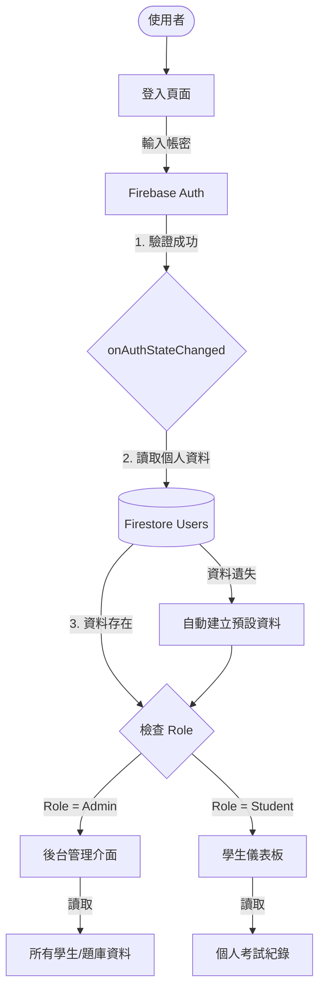

# 專案 Firebase 規格與權限管理手冊

> 目的：提供標準化的 Firebase 設定、身份驗證流程與資料庫權限管理規範，供未來專案快速複製使用。

---

## 1. 目標 (Goal)
- **標準化**：統一所有專案的 Firebase 初始化與登入流程。
- **權限分流**：明確定義「管理員 (Admin)」與「學生 (Student)」的權限邊界。
- **自動化**：確保使用者資料遺失時能自動修復 (Auto-restore)。

---

## 2. 需求假設 (Assumptions)
- 專案使用 **Firebase v9 Modular SDK**。
- 資料庫使用 **Cloud Firestore**。
- 身份驗證僅使用 **Email/Password** 登入（不含第三方登入）。
- 只有特定 Email (`admin@test.com`) 可擁有最高管理權限，其餘預設為學生。

---

## 3. 架構 (Architecture)

### 核心資料流


---

## 4. 實作 (Implementation)

### A. 設定檔 (`firebase.js`)
標準模組化設定檔，請建立於專案根目錄。

```javascript
import { initializeApp } from "https://www.gstatic.com/firebasejs/9.15.0/firebase-app.js";
import { 
    getAuth, 
    signInWithEmailAndPassword, 
    signOut, 
    onAuthStateChanged 
} from "https://www.gstatic.com/firebasejs/9.15.0/firebase-auth.js";
import { 
    getFirestore, 
    collection, 
    doc, 
    getDoc, 
    setDoc, 
    updateDoc, 
    query, 
    where, 
    getDocs,
    onSnapshot
} from "https://www.gstatic.com/firebasejs/9.15.0/firebase-firestore.js";

const firebaseConfig = {
    apiKey: "YOUR_API_KEY", // <--- 請替換
    authDomain: "YOUR_PROJECT.firebaseapp.com",
    projectId: "YOUR_PROJECT_ID",
    storageBucket: "YOUR_PROJECT.firebasestorage.app",
    messagingSenderId: "SENDER_ID",
    appId: "APP_ID"
};

const app = initializeApp(firebaseConfig);
const auth = getAuth(app);
const db = getFirestore(app);

export { 
    auth, db, 
    signInWithEmailAndPassword, signOut, onAuthStateChanged,
    collection, doc, getDoc, setDoc, updateDoc, 
    query, where, getDocs, onSnapshot 
};
```

### B. 資料庫結構 (Firestore Schema)

**集合：`users`**
| 欄位 (Key) | 類型 | 必填 | 說明 |
|:--- |:--- |:--- |:--- |
| `email` | String | Yes | 帳號識別 |
| `name` | String | Yes | 顯示名稱 |
| `role` | String | Yes | **核心權限** (`admin` / `student`) |
| `createdAt` | String | Yes | 註冊時間 ISO |

### C. 權限判斷邏輯 (`index.js`)
在主程式入口處監聽身份狀態。

```javascript
/* 範例程式碼 */
import { auth, db, onAuthStateChanged, doc, getDoc, setDoc } from './firebase.js';

onAuthStateChanged(auth, async (user) => {
    if (user) {
        // 1. 嘗試讀取使用者資料
        const userRef = doc(db, "users", user.uid);
        let userSnap = await getDoc(userRef);

        // 2. 自動修復 (Auto-Restore): 若 Auth 存在但 Firestore 無資料
        if (!userSnap.exists()) {
            const newUserData = {
                email: user.email,
                name: user.displayName || user.email.split('@')[0],
                // 若為指定 Email 則給予 Admin 權限，否則為 Student
                role: user.email === 'admin@test.com' ? 'admin' : 'student', 
                createdAt: new Date().toISOString()
            };
            await setDoc(userRef, newUserData);
            userSnap = await getDoc(userRef); // 重新讀取
        }

        const userData = userSnap.data();

        // 3. 路由導向
        if (userData.role === 'admin') {
            // TODO: 載入管理員視圖 & 資料
            console.log("Admin Logged In");
        } else {
            // TODO: 載入學生視圖 & 資料
            console.log("Student Logged In");
        }
    } else {
        // 未登入處理
        console.log("No User Logged In");
    }
});
```

### D. 安全性規則 (Security Rules)
請在 Firebase Console > Firestore > Rules 貼上。

```javascript
rules_version = '2';
service cloud.firestore {
  match /databases/{database}/documents {
    
    // 輔助函式
    function isSignedIn() { return request.auth != null; }
    function isAdmin() {
      return isSignedIn() && 
        get(/databases/$(database)/documents/users/$(request.auth.uid)).data.role == 'admin';
    }

    // Users: 自己讀寫自己，管理員讀寫全部
    match /users/{userId} {
      allow read, write: if isSignedIn() && (request.auth.uid == userId || isAdmin());
    }
    
    // ExamHistory: 學生讀寫自己，管理員讀全部
    match /examHistory/{docId} {
      allow read: if isSignedIn() && (resource.data.userId == request.auth.uid || isAdmin());
      allow create: if isSignedIn() && request.resource.data.userId == request.auth.uid;
    }
    
    // 公開/唯讀資料 (題庫)
    match /questions/{qId} {
      allow read: if isSignedIn();
      allow write: if isAdmin();
    }
  }
}
```

---

## 5. 測試與驗收 (Checklist)

- [ ] **登入測試**：使用 `student@test.com` 登入，應看到學生介面。
- [ ] **管理員測試**：使用 `admin@test.com` 登入，應看到管理介面。
- [ ] **自動修復測試**：
    1. 在 Firebase Console 刪除某個 user 的 Firestore 文件 (但保留 Auth)。
    2. 該 user 重新整理網頁/登入。
    3. 系統應自動重建該文件，且程式不崩潰。
- [ ] **權限測試**：學生嘗試寫入 `questions` 集合應被 Firestore 拒絕 (Permission Denied)。

---

## 6. 可擴充 (Next Steps)

1. **Google 登入**：目前僅實作 Email 登入，未來可於 `firebase.js` 引入 `GoogleAuthProvider`。
2. **多角色擴充**：`role` 欄位可改為 Array 或更複雜的 Object (如 `{ admin: true, editor: false }`) 以支援助教或編輯角色。
3. **使用者狀態**：新增 `status: 'active' | 'banned'` 欄位，在 `onAuthStateChanged` 中檢查，若為 `banned` 則強制 `signOut()`。
